# 第一题


<object data="./../static/zt-2019.pdf" type="application/pdf" width="700px" height="700px"> 
    <embed src="./../static/zt-2019.pdf"> 
     This browser does not support PDFs. Please download the PDF to view it: <a href="./../static/zt-2019.pdf">Download PDF</a>.</p> 
    </embed> 
</object> 


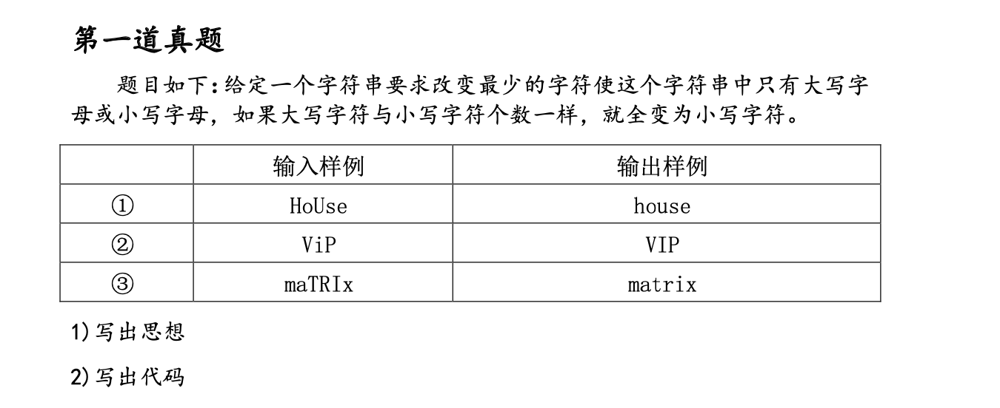

1. 本题目考察了字符串的结束标志 '\\o'
2. 字符串的存储形式是数组。可直接通过%s输出
3.  考察了ASCIL表的字母表

```c
# include<stdio.h>
int main(){
    char input[10];
    char output1[10];//存放大写字母
    char output2[10];//存放小写字母
    int big=0,small=0;//大小写字母数量累加器
    int i = 0;//计数器
    int j = 0;

    scanf("%s",&input);

    for(;i<(sizeof(input)/sizeof(char)); i++){
        if (input[i] == '\0'){ //这个很重要，遇到字符串终结，退出循环
            break;
        }

        if ((input[i]>='a')&&(input[i]<='z')){
            small++;
            output1[i] = input[i] - 32; //小写转大写
            output2[i] = input[i];
        }
        else
        {
            big++;
            output1[i] = input[i];
            output2[i] = input[i] + 32; //大写转小写
        }
    }

    if (big>=small){ //数量比较，选择合适输出
    
        printf("%s",output1);
    }
    else
    {
        printf("%s",output2);
    }
    return 1;

}

```


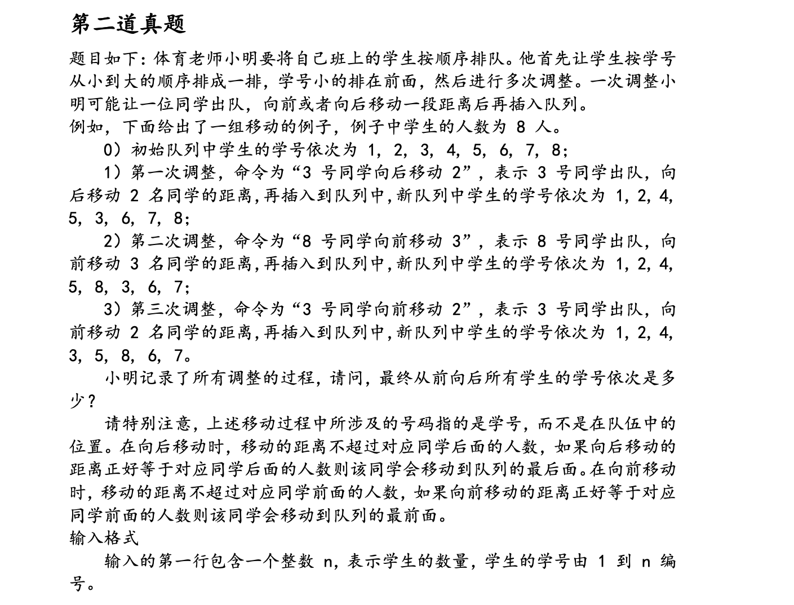

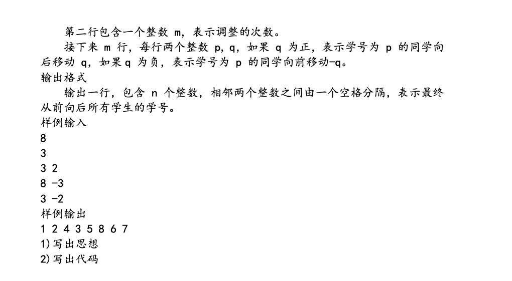

```c
#include<stdio.h>
#include"debug.c"

//操作函数
    // 插入
    int insert(int arr[], int pos, int offset){
        int a = arr[pos];
        int i = pos;
        if (offset>0){
            for( ; i< pos+offset; i++){
                arr[i] = arr[i+1];
            }
            arr[pos+offset] = a;
        }
        else
        {
            for( ; i> pos+offset; i--){
                arr[i] = arr[i-1];
            }
            arr[pos+offset] = a;
        }
        return i;
    }

    int locat(int arr[], int value){

        int i =0;
        for(; i<10;i++){
            if (arr[i] == value){
                break;
            }
        }

        printf("%d %d\n",i,value);

        return i;
    }

int main(){

    //数组定义和初始化完成
    int n, i, j;
    int pos,offset,value;
    int input[10];
    
    scanf("%d",&n);
    scanf("%d",&j);

    for(i=0; i<n;i++){
        input[i] = i+1;
    }

    for(i=0; i<j; i++){
        scanf("%d%d",&value,&offset);
        pos = locat(input,value);
        insert(input,pos,offset);
    }
    
    return 0;
}
```


1. C语言的输入输出，区别于python
2. 指针删除方法注意判断尾指针是否为空
3. for循环内部变量可不能声明

```c
#include<stdio.h>
#include<stdlib.h>
// #include"debug.c"
typedef struct stu{
    struct stu * fr;
    struct stu * be;
    int number;
}stu,*stulink;

// 初始化链表
stulink initlink(){
    stulink link;
    link = (stulink) malloc(sizeof(stu));
    link->be = NULL;
    link->fr = NULL;
    link->number = 0;
    return link ;
}

// 在链表中定位给定的值的节点
stulink link_locate(stulink link_head, int value){
    stulink link_move = link_head;
    int i = 0;
    for(; ; i++ ){
        if(link_move->number == value){
            break;
        }
        if(link_move->be == NULL){
            break;
        }
        link_move = link_move->be;
    }

    // del link_move
    link_move->fr->be = link_move->be;
    if(link_move->be == NULL){
        link_move->number = i;
        return link_move;
    }
    link_move->be->fr = link_move->fr;
    link_move->number = i;

    return link_move;
}

// 在链表中插入指定节点
int link_insert(stulink link, stulink link_tag, int value, int offset){
    stulink link_move = link;
    for(int i =0; i< link_tag->number+offset; i++){
        link_move = link_move->be;
    }
    link_tag->be = link_move;
    link_tag->fr = link_move->fr;

    link_move->fr = link_tag;
    link_tag->fr->be = link_tag;

    link_tag->number = value;

    return 1;

}

// 主函数，输入输出，结果问题
stulink save_by_link(){
    int n;
    scanf("%d",&n);
    int times;
    scanf("%d",&times);
    int value, offset;

    stulink link_head = initlink();
    stulink link_move = link_head;
    stulink link_new = link_head;
    // 输入初始化

    for(int i = 1; i<= n; i++){
        link_new = (stulink) malloc(sizeof(stu));
        link_new->be = NULL;             

        link_new->number = i;
        link_move->be = link_new;
        link_new->fr = link_move;
        link_move = link_new;
    }

    for(int i = 0; i<times; i++){        
        scanf("%d%d",&value,&offset);
        link_move = link_locate(link_head,value);
        link_insert(link_head,link_move,value,offset);
        for(stulink a=link_head;a->be != NULL;a = a->be){
        }
    }
    return link_head;
}


int main(){
    stulink link_head;
    link_head = save_by_link();
    do{
        printf("%d",link_head->number);
        link_head = link_head->be;
        free(link_head->fr);
    }while (link_head->be != NULL);
    printf("%d\n",link_head->number);
    free(link_head);
    return 0;
}
```


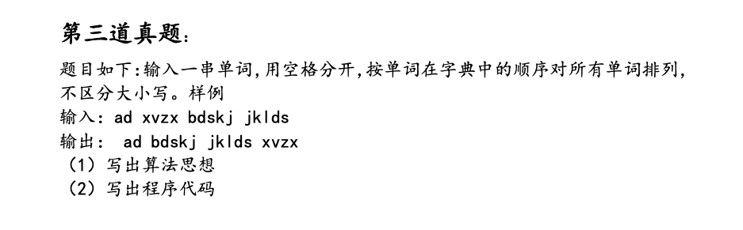


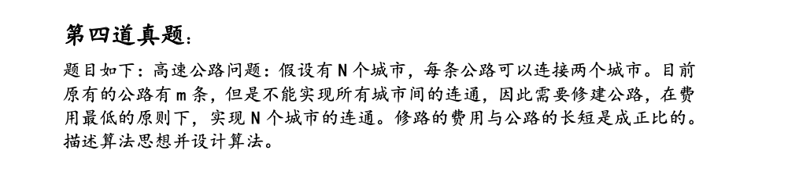

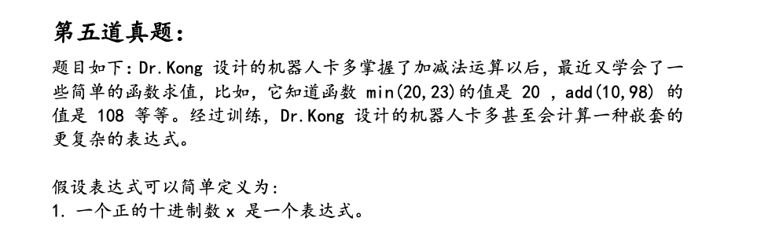

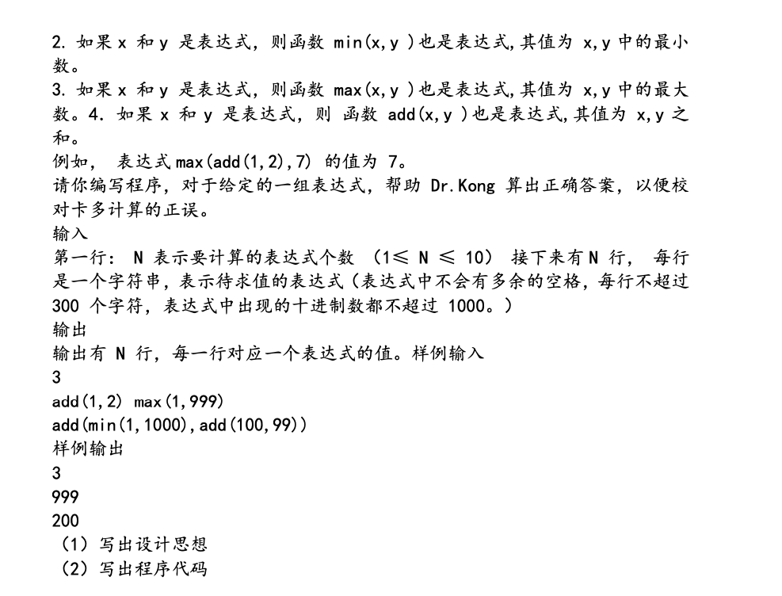

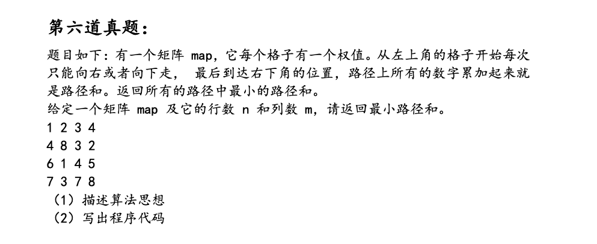

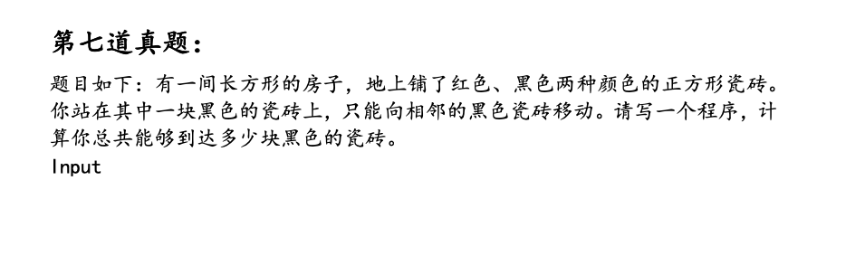

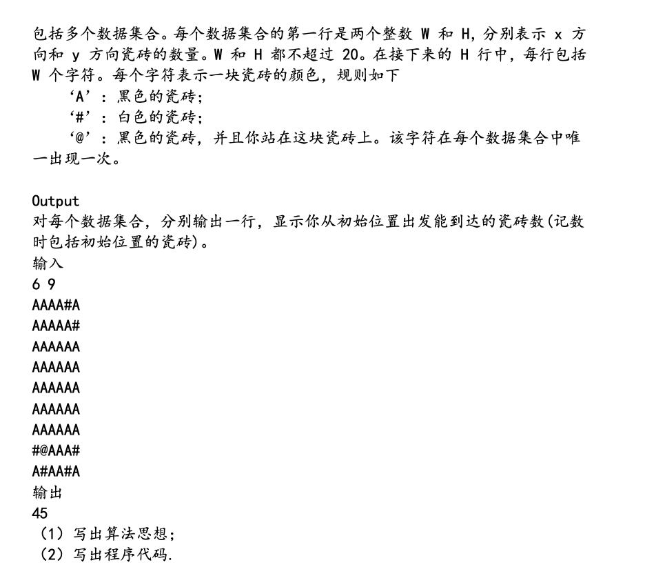

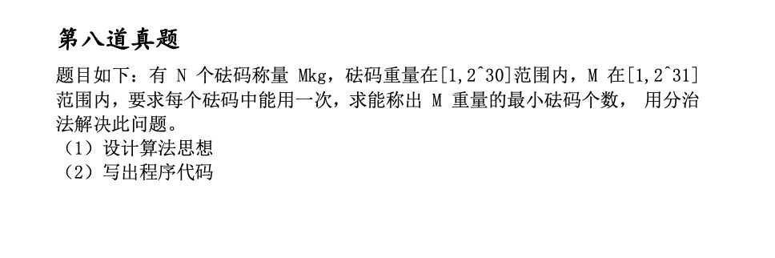