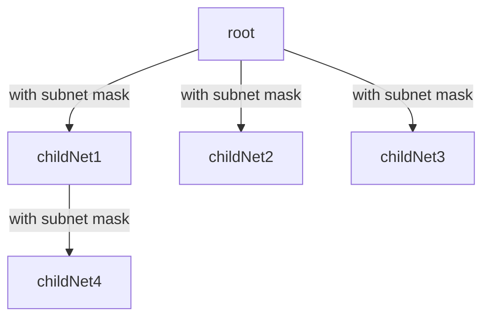

# 网络

> [参考文章：有了 IP 地址，为什么还要用 MAC 地址](https://www.zhihu.com/question/21546408/answer/2303205686)--bak--[--bak](https://mp.weixin.qq.com/s/jiPMUk6zUdOY6eKxAjNDbQ)

ARP：地址解析协议，即由IP获得物理地址的TCP/IP协议。主机加入网络或发送数据（如果表内未查到物理地址）广播一个ARP请求，该请求包含目标机器的网络地址，此网络上的其他机器都将收到这个请求，但只有被请求的目标机器会回应一个ARP应答，其中包含自己的物理地址

对于终端发送来说，先通过掩码判断是否在同一个子网，同一个子网则直接arp扔出去，否则arp默认网关携带IP地址扔出去
对于路由器来说，关心IP地址是什么，并修改Mac地址为下一点（IP地址就是逻辑编号，并且方便划分查找）
对于交换机来说，关心Mac地址是什么，选择合适的端口投递出去
对于终端接受来说，关心Mac地址是不是自己，自己则收，否则抛弃

子网掩码：通过开头连续的全一在逻辑上判断是否在同一个逻辑网络中。即区分了网络号和主机号

虚拟IP：即VIP（virtual IP）

OSI七层路由

