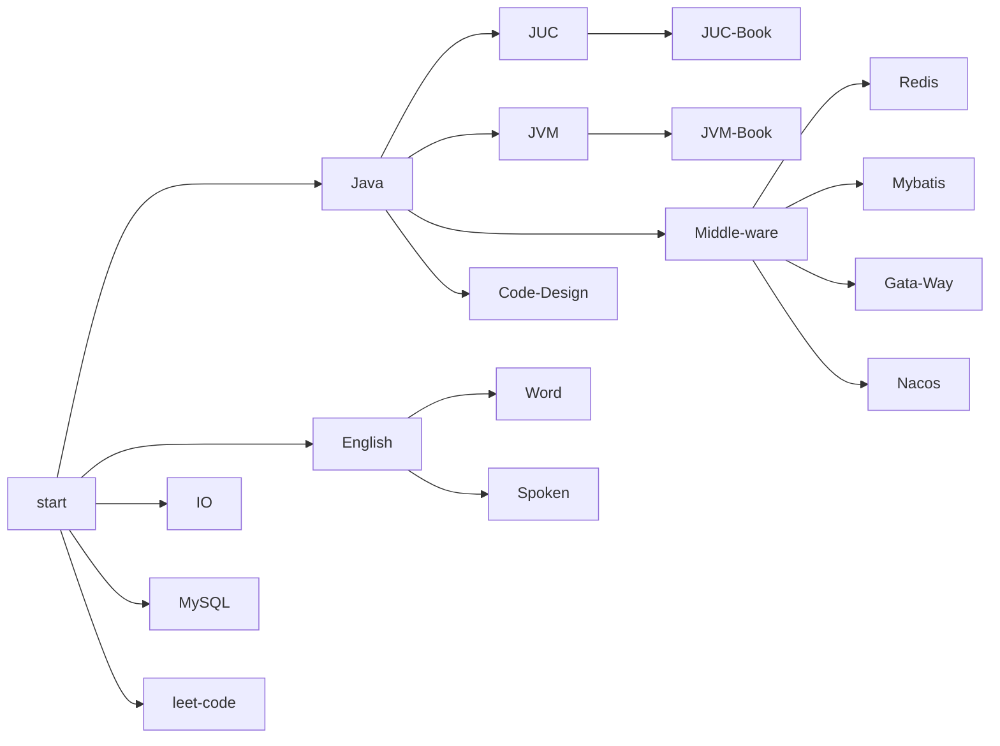

# TodoList

| Topic         | Emergence |  HadDone |Date       | DeadLine   | Note |
| ------------- | --------- | ---------- | ---------- | ------- | ------------- |
| 类图          | **        |  No    | 2022-12-07 |2022-12-15   |  |
| Flink                |           |         |            |            |      |
| Hadoop               |           |         |            |            |  |
| ElasticSearch        | \*\*\*\*  | No      | 2022-12-07 | 2022-12-31 |      |
| 设计模式及其应用场景 | \*\*\*\*  | No      | 2022-12-07 | 2022-12-15 |      |
|                      |           |         |            |            |      |
|                      |           |         |            |            |  |
|               |           |            |            |         |  |
|               |           |            |            |         |  |

2022-11-29

Redis 复习

JUC 复习

JVM 复习

英语单词

2022-11-07

并发编程的艺术，每天一个章节推进，约俩小时。

Redis笔记整理

2022-09-27

1. 线程池

2. Mybatis缓存

3. JVM

   

2022-11-02

1. JVM 笔记整理
2. 

