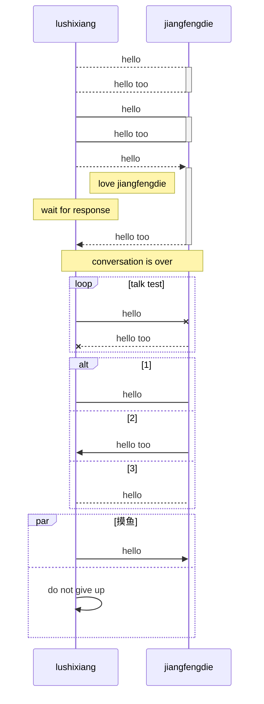
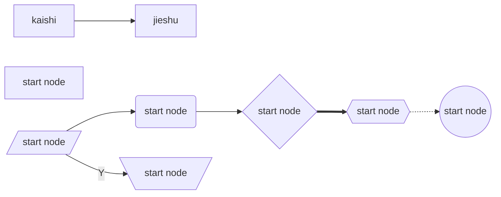
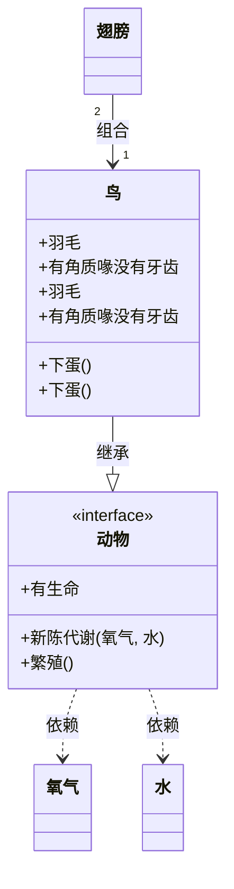
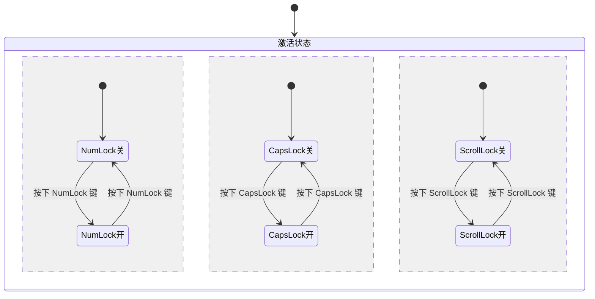

记忆方式

时序图，侧重方向，线只使用 - 。箭头得使用double

流程图，侧重连接，线使用- . 。箭头有无即可

类图，固定方式表达。线与箭头5+3表示

# 时序

page content example content[^exampleContent]

[^exampleContent]:example content 是为了演示脚注功能的实现

$x+y=z$

$ x \geq y = z$

$ x \div y =z $

# 类图

> 描述类与类与类之间的关系
>
> 类：所属包，类型，属性，方法
>
> 关系：数量关系，逻辑关系
>
> [参考地址：30分钟学会UML类图](https://zhuanlan.zhihu.com/p/109655171)

**属性**

public +

protect #

private -

default default

**方法**

+/-/# MethodName(XX) ReturnType

抽象类使用斜体，类使用常规体，接口标明\<interface>

包的表示

关系的表示

# Git

> 不错的文章[实用技巧和原理解读](https://colstuwjx.github.io/2020/11/git实用技巧和原理解读/)
>
> [彻底搞懂 Git-Rebase](http://jartto.wang/2018/12/11/git-rebase/)
>
> 千万不要用增量的方式理解。git一直是全量快照。开发使用intellij 一般都是自动add

Git区域概念：工作区，暂存区，本地仓库。对于所有分支来说，工作区和暂存区是公共的

本地仓库层级模型：git会有当前指针，head，head指向不同breach（方便切换breach）。breach指向version（提交对象）（breach切换到不同version），version指向Object（树对象记录着目录结构和blob对象索引），Object指向不同文件（含hash值）

工作区产生作业时：被改动文件会被另存。索引index指向最新

Git文件记录方式：Git记录各历史版本的全量快照，但是为了节约空间，对于没有更改的文件只是通过链接指向历史版本中的最新实体文件。SVN等是各个对于不同version保存增量diff。俩者带来的差别就是version切换后，Git可以直接切换到具体文件，而SVN需要逐个作用diff，生成该version的文件。

常见使用场景

1. 文件回退：git checkout fileName，git reset fileName，git checkout fileName
2. 文件暂存&分支切换：git stash/git stash pop 
3. commit合并：git rebase -i HEAD~4
4. branch合并：git rebase master/git merge master
5. commit转接：cherry-pick
<<<<<<< HEAD
=======

LATEX
>>>>>>> 2d3d04346993a0bd92580c05f2e9a99ab73b2a68
