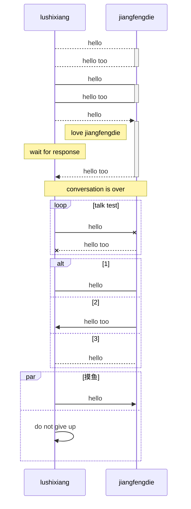
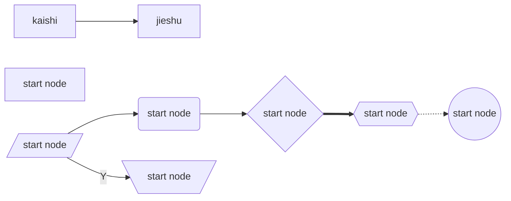

# 时序

```mermaid
sequenceDiagram 
participant l as lushixiang
participant j as jiangfengdie 
l -->+ j: hello
j -->- l: hello too

l ->+ j: hello
j ->- l: hello too

l -->>+ j: hello
note right of l: love jiangfengdie
note over l : wait for response
j -->>- l: hello too

note over l,j : conversation is over

loop talk test
	l -x j: hello
	j --x l: hello too
end 

alt 1
	l -> j: hello 
else 2
	j ->> l: hello too
else 3 
	l --> j: hello 
end


par 摸鱼
	l ->> j: hello 
and 
	l ->> l: do not give up
end 
```

```mermaid
graph LR
	kaishi  --> jieshu
	start[start node]
	start_01(start node)
	start_02{start node}
	start_03{{start node}}
	start_04((start node))
	start_05[/start node/]
	start_06[\start node/]
	
	start_01 --> start_02
	start_02 ==> start_03
	start_03 -.-> start_04
	start_05 --> start_01
	start_05 --Y--> start_06
```

page content example content[^exampleContent]

[^exampleContent]:example content 是为了演示脚注功能的实现

$x+y=z$

$ x \geq y = z$

$ x \div y =z $

