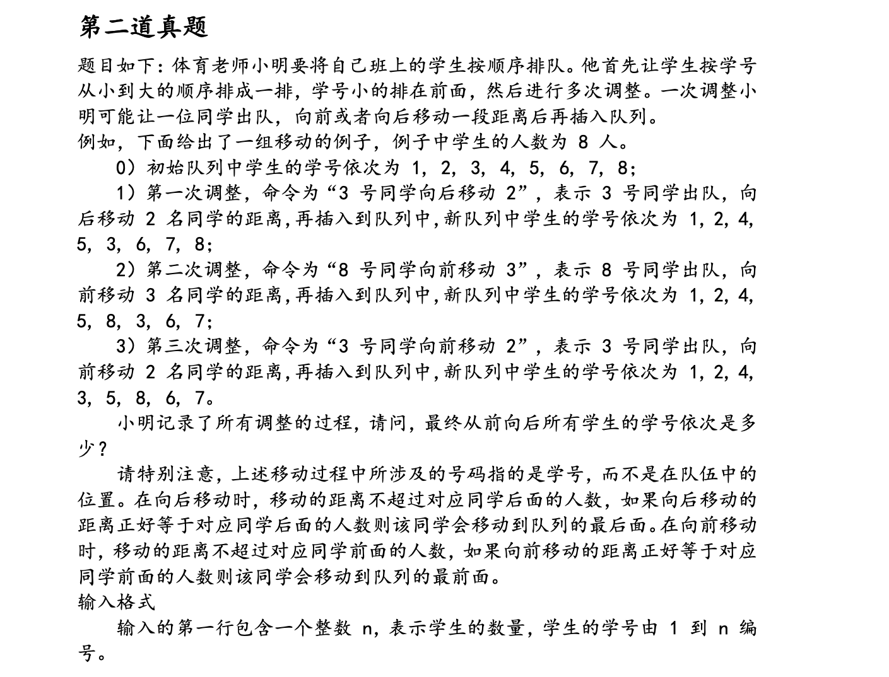

# 第一题


1. 本题目考察了字符串的结束标志 '\\o'
2. 字符串的存储形式是数组。可直接通过%s输出
3.  考察了ASCIL表的字母表

```c
# include<stdio.h>
int main(){
    char input[10];
    char output1[10];//存放大写字母
    char output2[10];//存放小写字母
    int big=0,small=0;//大小写字母数量累加器
    int i = 0;//计数器
    int j = 0;

    scanf("%s",&input);

    for(;i<(sizeof(input)/sizeof(char)); i++){
        if (input[i] == '\0'){ //这个很重要，遇到字符串终结，退出循环
            break;
        }

        if ((input[i]>='a')&&(input[i]<='z')){
            small++;
            output1[i] = input[i] - 32; //小写转大写
            output2[i] = input[i];
        }
        else
        {
            big++;
            output1[i] = input[i];
            output2[i] = input[i] + 32; //大写转小写
        }
    }

    if (big>=small){ //数量比较，选择合适输出
    
        printf("%s",output1);
    }
    else
    {
        printf("%s",output2);
    }
    return 1;

}

```





```c
#include<stdio.h>
typedef struct stu{
    struct stu * fr;
    struct stu * be;
    int number;
}stu;

//操作函数
    // 插入
    int insert(int *arr[], int pos, int offset){
        int a = arr[pos];
        int i = pos;
        if (offset>0){
            for( ; i< pos+offset; i++){
                arr[i] = arr[i+1];
            }
            arr[pos+offset] = a;
        }
        else
        {
            for( ; i> pos+offset; i--){
                arr[i-1] = arr[i];
            }
            arr[pos+offset] = a;
        }
        
    }

    int locat(int arr[], int value){
        for(int i =0; i<(sizeof(arr)/sizeof(arr[0]));i++){
            if (arr[i] = value){
                break;
            }
        }
        return i;
    }

int main()}{

    //数组定义和初始化完成
    int n, i, j;
    int pos;
    char input[10];
    printf("输入学生数:");
    scanf("%d",&n);
    int arr[n];
    for(;i<n;i++){
        arr[i] = i;
    }

    //调用功能函数
    for(i=0; i<n; i++){
        gets(input);
        
    }
    return 1;
}
```


