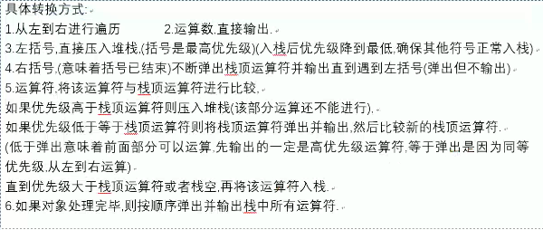

# 栈

栈只有一个指针top，控制栈的出入和判空判满。

```c
int stack[maxsize];
int top = -1; //下标

stack[++top] = temp; //前++和后++ 一句话总结一下就是出栈后--，入栈先++；
temp = stack[top--];
//只是单纯的出栈
top--;

//栈判空
top == -1;
//如何判满
top == maxsize - 1;
```


# 队列

```c
int queue[maxsize];
int rear = 0; int front = 0;

//入队，出队
rear ++;
queue[rear] = temp;
queue[++rear] = temp;

//出队
font++;
temp = queue[front];
temp = queue[++front];

//队列判空,front所指向的不属于队列元素。 
front == rear;


//循环队列
//在每次出队入队中，实现了循环队列
rear = (rear+1)%maxsize;
front = (front+1)%maxsize;

//判空，判满
front == rear;
(rear+1)%maxsize == front;
```


# 共享栈

```c
int stack[maxsize];
int top1 = -1, top2 = maxisize - 1;

// 共享栈1号入
stack[++top1] = temp;

// 共享栈2号入
stack[--top] = temp;

// 共享栈1号出
temp = stack[top--];

// 共享栈2号出
temp = stack[stack++];

// 共享栈判空
top1 == -1 && top2 ==maxsize - 1;

// 共享栈判满
top1+1 == top2;


```


# 栈模拟队列

```c
// 初始化
int stack1[maxsize];
int stack2[maxsize];
int top1 = -1, top2 = -1;

// 入队
stack1[++top] = temp;

// 出队
temp = stack2[top--];

// 判空
top1 == -1 && top2 == -1;

// 判满
top1 == maxsize - 1;
```


# 题目

- 火车入站出站

- 括号匹配

  - 左入，右出匹配，失败直接break，
  - 判断栈是否为空

- 中缀表达式转后缀表达式

  - ```c
    //中缀转后缀表达式
    // A+B*(C-D)-D/F
    // ABCD-*+DF/-
    
    #include<stdio.h>
    # define maxsize 10
    
    int zzh(char *arr, int n){
        // 初始化栈
        char stack[maxsize];
        int top = -1;
        
        for(int i = 0; i< n-1; i++){
            
            // 遇到字母，直接打印
            if(arr[i]>='A' && arr[i] <='Z'){
                printf("%c", arr[i]);
            }
            
            // 遇到 （ * / 全部入栈
            if(arr[i] == '(' || arr[i] == '*' || arr[i] == '/'){
                stack[++top] = arr[i];
            }
            
            // 遇到 ）全部出栈到（
            if(arr[i] == ')'){
                while(stack[top]!='('){
                    printf("%c", stack[top--]);
                }
                top--;
            }
            
            // 遇到+ - ，全部出栈到栈空，除非遇到‘（’ 最后将+ - 入栈
            if(arr[i]  == '+' || arr[i] =='-'){
                while(stack [top] != '(' && top != -1){
                    printf("%c",stack[top--]);
                }
                stack[++top] = arr[i];
                
            }
        }
    
        // 输出所有stack栈内元素
        while(top>-1){
            printf("%c",stack[top--]);
        }
        
        return 0;
    }
    
    
    int main(){
        char arr[] = "A+B*(C-D)-D/F";//字符串的末尾是有结束标志符的'\0'
        zzh(arr, 14);
        return 0;
    }
    
    ```

  - 自己总结一下：

    - 遇到 * / 直接入栈， 

    - 遇到+ -清空栈（遇到 '\(' 则停止清）
    - 遇到 ')'  全部出栈到 '\(';

  - 

- 后缀表达式计算

  - sf
  - switch case

- 栈模拟队列

  - 空和满
  - b不为空，a满，则队满
  -  