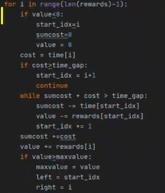
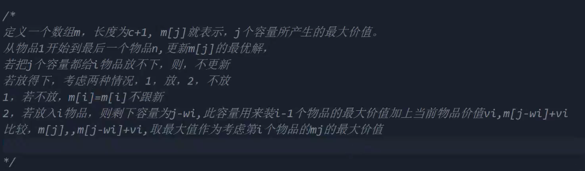

 

算法的思想：原问题 -> 数学问题 -> 子问题关系（递归，分治，动态规划）， -> 边缘条件 -> 代码

# 1: 递归与分治策略

## 1.1 递归的概念

 1. 概念：直接或间接调用自身的算法称为递归算法。用自身给出定义的函数称为递归函数。每个函数都必须有非递归定义的初始值；

 2. 一般思路：

    原问题 -> 数学公式 -> 递归公式 -> 边缘条件 -> 代码

    - 例 1.1 阶乘函数 

    - 全排列问题

      ```c
      #include<stdio.h>
      void perm(int arr[], int n, int s){
          if (n == s){
              for(int i = 0; i<n; i++){
                  printf("%d",arr[i]);
              }
              printf("\n");
              return;
          }
          for(int i = s; i< n; i++){
              int temp = arr[s];
              arr[s] = arr[i];
              arr[i] = temp;
              
              perm(arr, n, s+1);
              
              temp = arr[s];
              arr[s] = arr[i];
              arr[i] = temp;
              
          }
          return;
          
      }
      int main(){
          int a[] = {1,2,3};
          perm(a, 3, 0);
          return 0;
      }
      ```

      

    - 整数划分

      f ( n, m )  : 表示在n的整数划分中最大加数最大可为m。然后考虑m是否出现。作为分类递归依据

    - Hanoi塔问题

    
## 1.2 分治法的基本思想

1. 概念：分治法的基本思想是将一个规模为n的问题分解为K个规模较小的子问题，这些子问题互相独立且与原问题相同。递归的解决这些子问题，然后将各个子问题的解合并得到原问题的解。

   - 二分搜索技术
   
     Left right mid.
   
   - 大整数的乘法
   
     
   
   - Strassen矩阵乘法
   
     矩阵相乘次数可以减少一次。实现事件复杂度的优化
   
   - 棋盘覆盖
   
     判断位置，然后不断递归。L形式排列。
   
   - 随机线性选择
   
   - 线性时间选择
   
     - 找中位数，16个数字，我们划分四组，每组找中位数
     - 
   
   - 最接近点对问题
   
     - 要么在左边，要么在右边，要么在中间  
   
   - 循环赛日程表
   
     -  对角填充  
   
     - 代码解析：就不写注释型，我就要杀我自己，这个怎么理解呢，画好图，找好关系。傻逼写不好power函数，我真是觉得自己傻逼十足，对角填充的关系，K次方，自行理解，
   
       三层循环嵌套。理解好每一层循环是什么意思，这题还是很简单的。
   
       这题目还有个老生常谈的问题，就是数组下标从0开始，我们如何做到逻辑上和实际上统一！！！
   
       ```c
       #include<stdio.h>
       
       int print_2_arr(int *arr,int n){
           for(int i = 0; i < n; i++){
               for(int j = 0; j < n; j++){
                   printf(" %d ",*(arr+i*n+j));
               }
               printf("\n");
           }
           return 0;
       }
       
       int power_my(int n, int m){
           int temp=1;
           if (m == 0){
               return 1;
           }
           for(int i=0; i<m; i++){
               temp =temp*n;
           }
           return temp;
       }
       
       int xunhuansai(int arr[][9], int n){
           int t = n;
           int i = -1;
           for(int f = 2;f<n;i++){
               f *= 2;
           }
       
           for(int k = 1; k<=3; k++){
               t /= 2;
               for(int i = power_my(2,(k-1))+1; i<=power_my(2,k); i++){
                   int  b=1;
                   for(int j = 1; j<=n; j++){
                       arr[i][j] = arr[i-power_my(2, k-1)][j+b*power_my(2, k-1)];
                       if(j % power_my(2, k-1) == 0){
                           b = -b;
                       }
                   }
               }
           }
           return 0;
       }
       
       int main(){
           int arr[9][9] = {0};
           for(int i=1; i<9; i++){
               arr[1][i] = i;
           }
           
           xunhuansai(arr, 8);
           print_2_arr(&arr[0][0], 9);
           return 0;
       }
       
       ```
   
2. 额外扩展：

   - 分治法的俩种形式（下标：mid = (left + right) / 2 和 值：取某位大小分俩边的]）

     + 区别：
       + 会打乱原有顺序
       + 时间复杂度不一样 log n 和 n或nlogn

     - 相同点：
       + 都是划分成俩个相同子问题，然后求解子问题

   - 哈希表 散列，实现的是向另一个数组映射。用A数组的值，映射成B数组的地址，然后可以记录值出现的次数


# 动态规划

## 动态规划概念

- 考虑俩：最优子结构 和 重叠子问题。

  - 动态规划，自底向上，从0/1开始逐渐扩展到目的X，然后解得Y（这个一般可以在一个for循环内部完成）
  - 备忘录算法，自上向下，从X依照递推式划分子问题（划分的过程中也要判断此时备忘录数组中是否存在已经有满足条件解），划分到满足边缘条件时，在一维或者二维中记录Y值，然后不断return。
  - 时间复杂度和空间复杂度
    - 时间复杂度
    - 空间复杂度优化 一个问题划分成几个子问题，这些子问题的最优值，我们该如何保存。

- 矩阵连乘

  - 从规模角度开始考虑 
  - traceback函数，可采用递归打印便于理解：先判定是否完成打印，然后打印左括号，然后继续左递归右递归，然后右括号。

- 硬币找零（*）

  - 原问题转成数学问题：F( x,y ) = z;
  - 建立递推式。
  - 边缘条件

  - y = 0; return 0;      y<0; return INF;

  - 代码（自底向上（动态规划），自上向下（递归中的改良-备忘录方法）） 

    ```c
    #include <stdio.h>
    //找零问题-动态规划
    int INF = 9999;
    int get_min(int a, int b, int c){
        if(a>b){
            if(b>c){
                printf("chose i-5\n");
                return c;
            }
            else
                printf("chose i-3\n");
                return b;
        }
        else{
            if(a>c){
                printf("chose i-5\n");
                return c;
            }
            else
                printf("chose i-2\n");
                return a;
        }
    }
    
    int return_cash(int *value, int n, int *m, int s){
        for(int i = 5; i<=s;i++){
            printf("这是%d： ",i);
            m[i] = get_min(m[i-2]+1, m[i-3]+1, m[i-5]+1);
        }
        return 0;
    }
    
    int main(){
        int value[] = {2,3,5};
        int n=3;
        int s = 14;
        int m [15];
        
        //初始化m表， 写int m[15] = {INF};居然有问题
        for(int i = 0; i<15;i++){
           m[i] = 999;
        }
        m[0] = 0;
        for(int i = 0; i<n; i++){
            m[value[i]] = 1;
        }
        
        return_cash(value, n, m,s);//m:可找零的额度，n:零钱种类数，m:当前下标，找零方案最优解，s:待找零数。
        printf("%d",m[s]);
        return 0;
    }
    
    ```

    

- 最长公共子序列（数学问题自变量，因变量确定问题）

- 最大子串和

  - 分析问题：题目要求寻找最大公共字段和，即寻找n个数字的字段和，我们可以找到前n-1最大字段和，~~如果最后一个可以被连续包括，那么我们就加上第n个判断是否增加，否则不加(这是自顶向下算法，可参照分治法）~~  我们从1出发，设置变量max和b，如果当前不为负，我们继续往后吃（b += arr[i]) ，如果当前为负，果断把前面舍弃，重置累加b = arr[i]如果。直到吃到第n个结束。这里考虑变量max作为最大记录值，left和right的及时更新。

  ```c
  #include <stdio.h>
  //最大字段和的动态规划算法
  int Get_max(int *arr, int n){
      int left=0,right=0,now_max=0;
      int b = 0;
      b = arr[0];
      for(int i = 1; i<n; i++){
          printf("nowmax:%d\n",now_max);
          if(b<0){
              b = arr[i];
              left = i;
            	if(b>now_max){
                  now_max = b;
                	left = i;
                  right = i;
              }
          }
          else{
              b = b+arr[i];
              if(b>now_max){
                  now_max = b;
                  right = i;
              }
          }
      }
      printf("left:%d  right:%d  Max:%d\n",left+1,right+1,now_max);
      return 0;
  }
  int main(){
      int arr[] = {-2, 11, -4, 13, -5, -2};
      Get_max(arr, 6);
      return 0;
  }
  ```
  
  - 补充，增加限制条件的最大字段和
  
    
  
- 三角剖分

  - 其递归式基本和矩阵连乘相同（矩阵末项是乘，这个是三边相加）
  - 对于这种规模类求解，最优三角剖分，矩阵连乘呀，我们动态规划自底向上，先从小规模开始起算，
    - 第一层循环：不断扩大解决规模 r：`( r = 2; r < n; r++)`，规模为1，一般置为0，且一般从2开始，
      - 第二层循环：对于目的规模总数为n的原问题，每个规模 r 下，我们有着`n-r+1`个子问题待求，（i = 1; i <= n-r+1; i++);
        - 第三层循环：实际上是对子问题求最优解，在一个范围 `i` 到 `i+r-1` 内取最优解。

- 0-1 背包

  - 0-1背包考虑的事情放与不放的问题，~~书上和网课思路不尽相同。书上是物品种类不变，从背包容量变化开始动态规划~~，网课大循环是物品种类增加，内循环是物品种类一致下，背包容量增加开始动态规划。
    - 对于当前背包，如果背包空间不足，m\[i]\[j] = m\[i-1]\[j]，空间足够则考虑当前放还是不放，我们可以通过取最大值 max ( m\[i]\[j] = m\[i-1][j-w\[i]] +v\[i], m\[i]\[j] = m\[i-1]\[j])  
    - 还可以使用一维数组m\[i]，一维数组需要考虑j要从后往前更新。
    - 

- 19真题第六题

  + 给我一个启示，原函数转换成数学问题是，想好f的变量有哪些。分析不好，可以分析题目。
  + 分析当前最优解，我们去找它的子问题，最优子问题。
  + 动态规划是工具，不要去凑动态规划，而是要去理解题意，选择使用工具（当然这不是绝对的）


# 贪心算法

  最优解，最优子结构

**贪心选择性**：每一步贪心选出来的一定是原问题的最优解的一部分

证明选出来的是最优解 

**最优子结构**：每一步贪心选完后会留下子问题，子问题的最优解和贪心选出来的解可以凑成原问题的最优解

证明子问题永远是最优解

- 活动安排问题 贪心选择的意义在于使剩下的可安排时间最大化
- 背包问题
  - 装入与未装入表示
- 最优装载
- 哈夫曼编码
  - 思路：是将出现频率最低（权重）的俩个合并作为子树产生一个根节点，然后根节点纳入一维数组中比较，再在一维数组中寻找俩个权重最低的继续重复上述操作。直至一维数组中仅有一个生成的根节点
  - 代码实现：
    - 

- 狄杰斯特拉算法（单源最短路径）
  - 思路：从源v出发，找当前离源最近的点 i，吃下它，然后更新到其他点的值（d\(v,i)+d\(i,k)<d\(v,k)则更新)，重复吃，直到吃完。
  - 代码实现：定义数组dist，。其记录点v到其他各点的距离，数组s记录每一个点是否被收录。在一个while循环里，先去找未被收录的最小的dist[i]，然后将其s中标记收录，更新其他各点距离
- 最小生成树（最小生成树性质）prim算法
  - 思路：初始化一个集合，集合中只有根节点，我们在外部这个集合最短的点，然后收录它直到找完所有的点。
  - 代码实现：
- Kruskal（克鲁斯卡尔） 算法
  - 如何判断产生闭环
    - 并查集，如何合理更新根节点
- 回溯法//深度优先遍
- 分支限界法//广度 优先遍历
  - 约束函数：在扩展处剪去不满足约束的子树
  - 限界函数 ：剪去不可能得到最优解的子树
- 八皇后问题


 


