#   行列式

## 1. 基本概念

   - n级排列

   - 逆序数

   - 做一次对换，奇偶性质改变

     证明可以考虑1和k次，K和k+1。

   - 二三阶行列式

## 2. n阶行列式定义及其求值。

   -  逆序法

     - 每项来自不同行不同列

       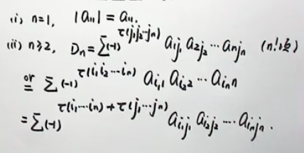

   - 展开式定义 // 代数余子式（按行或者按列展开）

     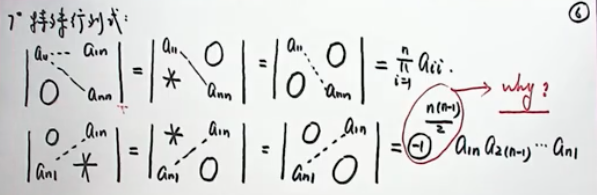

     

## 3. 行列式的性质与计算

   - DT = D（行列对称）
     
     - 换行或者换列（变号）
     
     - 俩行列元素相同（或成比例），则为零
     
     - 单行（单列）公因式可以提出来（通过代数余子式可以证明）这里注意数乘矩阵的区别。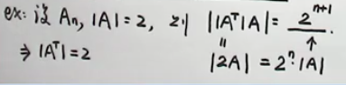
     
     - 对称矩阵（对角线不为零）和反对称矩阵（对角线必须为0）
     
     - 奇数阶反对称行列式的值为0；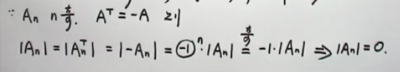
     
     - 分解性质\-同一行或列，可以分解相加。这个有点难理解（有种二叉树feel）时间：1-1.22 （二叉树，开选）
     
       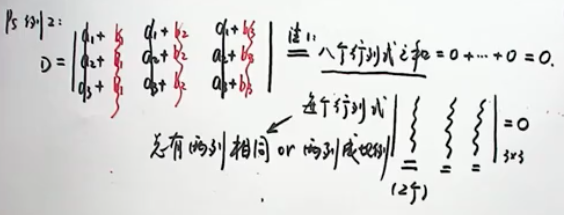
     
     - 由分解性质可以得到累加性质，一个行加到另一行，行列式的值不变。（造0，存在相同行列可以造0）

## 4.  行列式的计算

   -   降阶/化三角形
        
       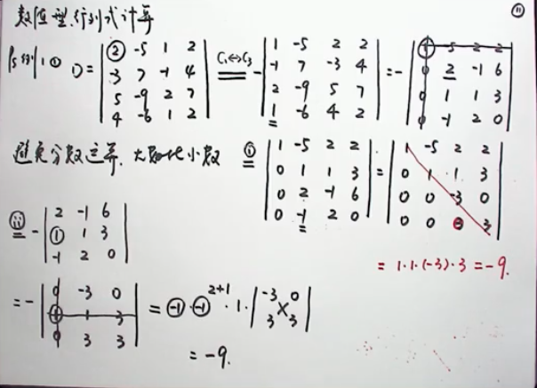
        
     
    - 各行元素相等的，各行元素和相等，列全累加到第一列。各行减第一行凑三角形（0-1.51）
       
      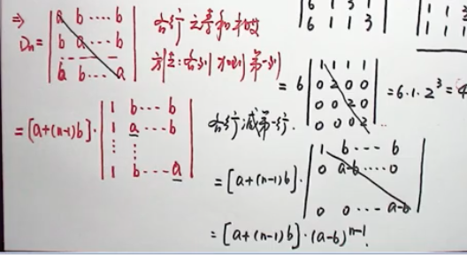
       
      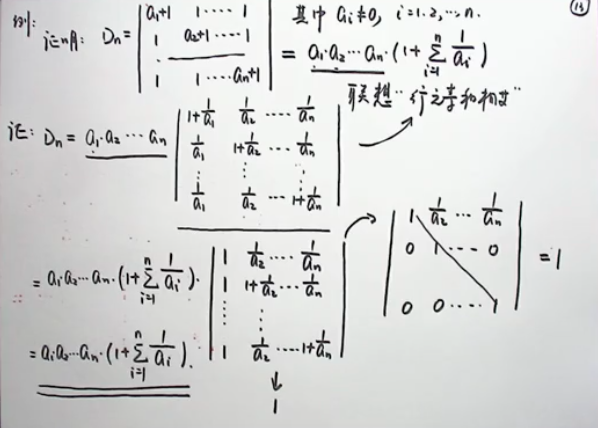
       
      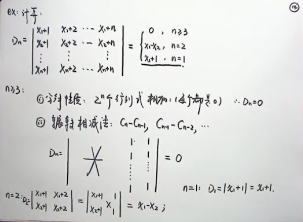
       
    - 爪型行列式
       
      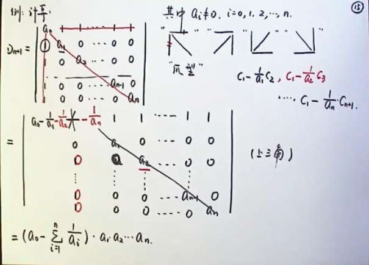
       
    - X型行列式
       
      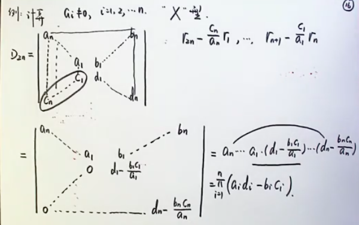
       
    - 三对角行列式
       
       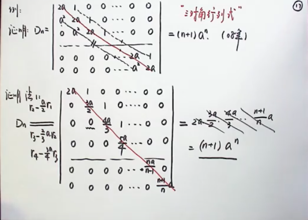
       
       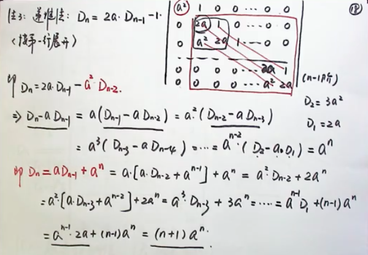
       
     - 范德蒙行列式
       
       - 什么是范德蒙行列式
       - 如何证明（见教材）
       - 结论：从a1被减开始，然后到an-1

## 5. 克拉默法则

分块思想

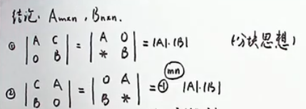

这里提到三种方法：行列调换造0， 分块思想， 定义式展开余子式。

代数余子式错位就是0；  

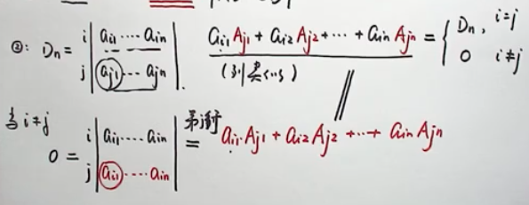

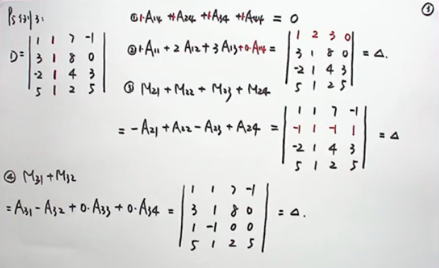

克拉默法则

1. A方阵，
2. 系数D！=0；
3. 则结论成立
4. 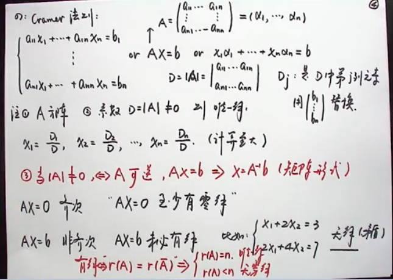

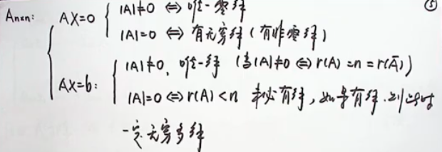

# 矩阵

## 1. 矩阵定义相关概念

+ 行矩阵，列矩阵，零阵。
+ 同型，相等
+ 三角阵，对角阵，数量矩阵（单位矩阵）
+ 对称矩阵（1-0.50）反对角矩阵，正交矩阵，正定矩阵，可逆矩阵，初等阵，幂等阵（A2 =A），对称阵

## 2. 矩阵线性运算

+ 加减法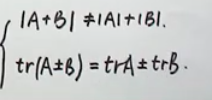

+ 数乘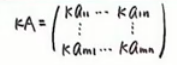

+ 矩阵相乘pass

  - AB！=BA

  - 列向量和行向量

  - 对角阵相乘（对角阵在左在右，都是对角阵？）

  - AB！=BA，但是trAB  = trBA

    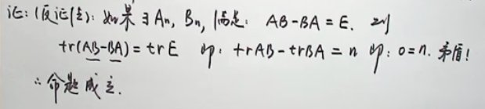

  - if AB = 0 推不出来 A = 0，或者 B= 0；

  - if AB = AC 得不到 B = C，除非A！=0；（A可逆）

+ 转置，

  - (AB)T = BT AT;

  - AT = A
  - AT = -A（反对称阵）
  - 证明一个矩阵有且只有一个对称矩阵和反对称矩阵和表示出来（表示法唯一）

+ 方阵的幂

  - （AB）K = AKBK
  - 立方差公式

+ 矩阵多项式

  - 对于常数项需要加E
  -  
  - 去发现这个各行列成比例

+ 二项展开法

  - 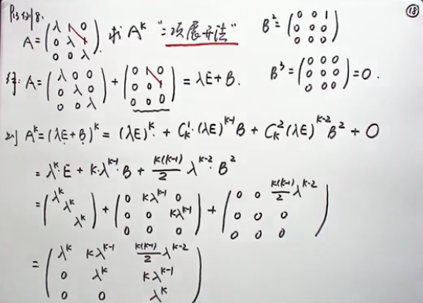

+ 方阵的行列式

  - AT = A；KA = Kn｜A｜。
  - ｜AB｜！=｜A｜*｜B｜
  - 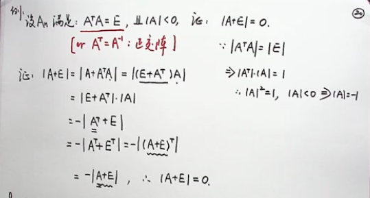
  - 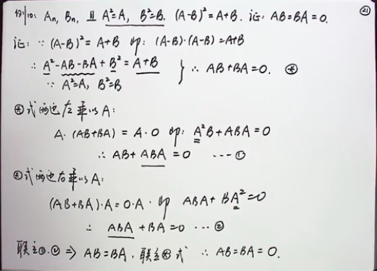
  - ATA = 0，A = 0；如何证明

## 3. 可逆矩阵

- 概念：得是方阵。AB= BA= E。称A可逆，A-1 = B；

  - 可逆矩阵由于它可以左乘右乘提取等，这点很灵活，在求解或证证明题可以疯狂用

  - 可逆是相互的，A-1-1=A；
  - 其唯一。（唯一性证明）

- 可逆矩阵的充要条件及其求法

  - 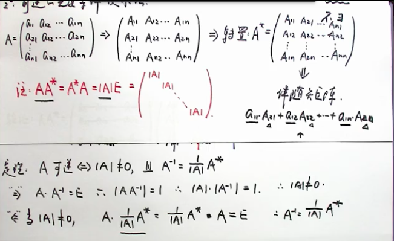

- 可逆矩阵求法

  - 伴随矩阵法

  - 初等变换法

  - 定义法AB = E，我们就去转化求B，直接求。恒等变化

    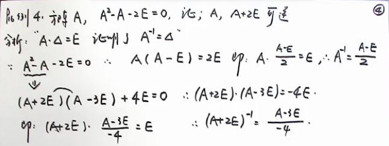

    一般会通过逆矩阵来左乘右乘证明可交换

    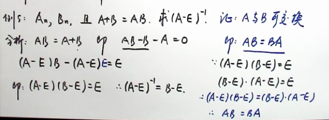

  - 分块求逆

- 逆矩阵的性质

  - 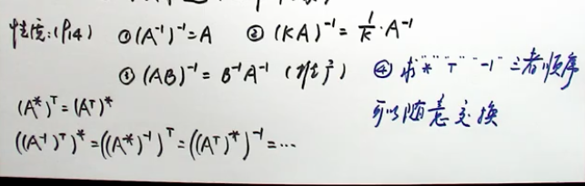

- A*的性质

  - A T = A，则A\*T = A\*

